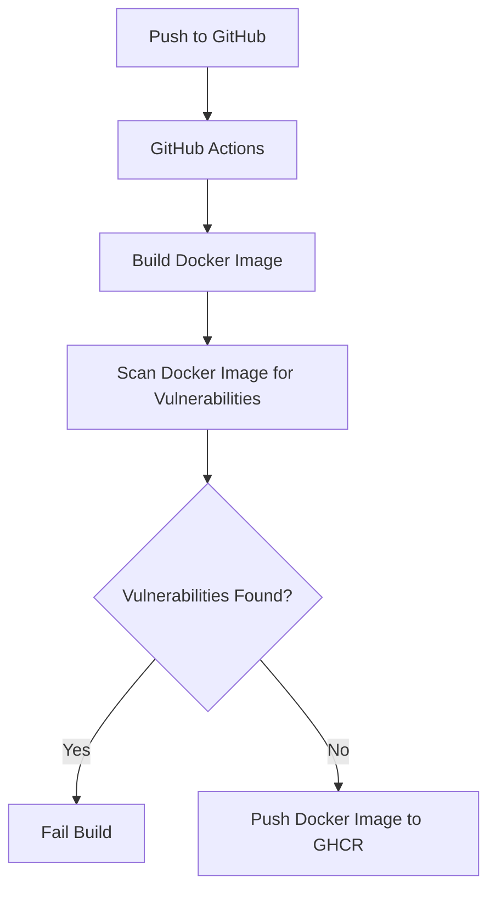

# Shopify Data Automation

This project automates the fetching of Shopify data, appending it to a Google Sheet, and sending notifications to a Slack channel.



## Features

- Fetch orders data from Shopify API.
- Calculate differences between current and previous values.
- Append data to a Google Sheet and format headers.
- Send notifications to a Slack channel.

## Setup

### Prerequisites

- Python 3.8 or higher
- Docker
- A Google Cloud project with Google Sheets API enabled.
- A Slack workspace and API token.

### Environment Variables

Create a `.env` file in the root directory of your project with the following content:

```env
SHOP_NAME=your_shop_name
API_VERSION=your_api_version
ADMIN_API_ACCESS_TOKEN=your_admin_api_access_token
GOOGLE_SHEET_ID=your_google_sheet_id
SLACK_API_TOKEN=your_slack_api_token
SLACK_CHANNEL_ID=your_slack_channel_id
GOOGLE_PROJECT_ID=your_google_project_id
GOOGLE_PRIVATE_KEY_ID=your_google_private_key_id
GOOGLE_PRIVATE_KEY=your_google_private_key
GOOGLE_CLIENT_EMAIL=your_google_client_email
GOOGLE_CLIENT_ID=your_google_client_id
GOOGLE_AUTH_URI=your_google_auth_uri
GOOGLE_TOKEN_URI=your_google_token_uri
GOOGLE_AUTH_PROVIDER_X509_CERT_URL=your_google_auth_provider_x509_cert_url
GOOGLE_CLIENT_X509_CERT_URL=your_google_client_x509_cert_url
```
